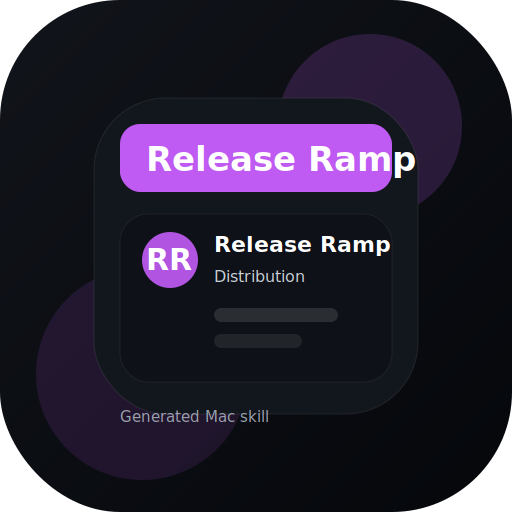
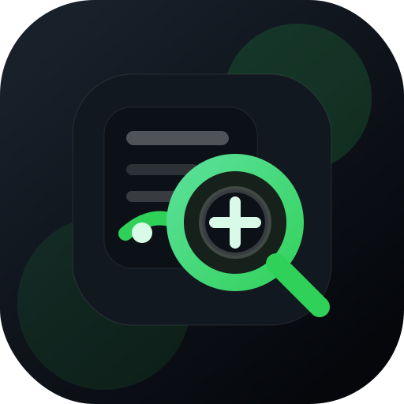
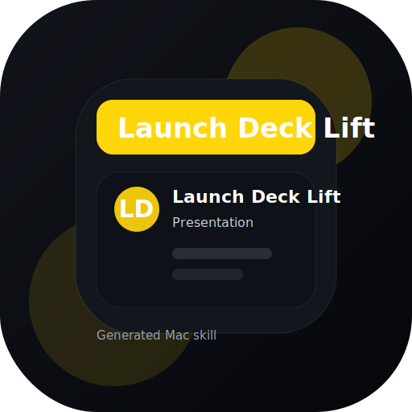
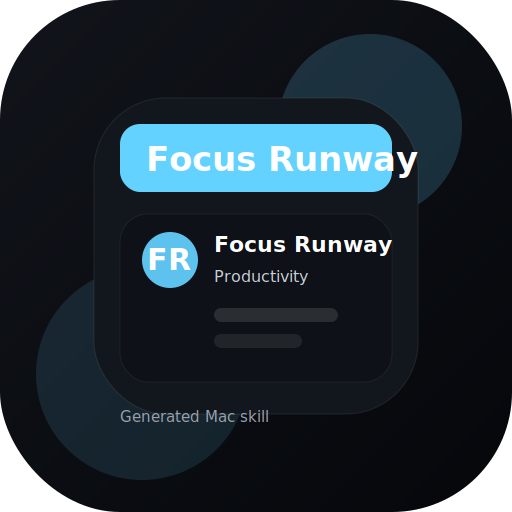
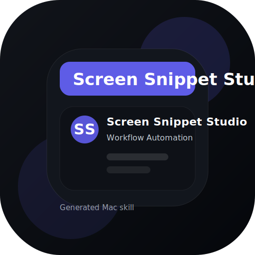
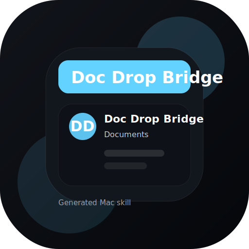
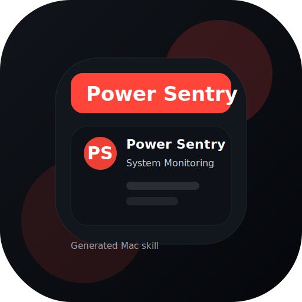
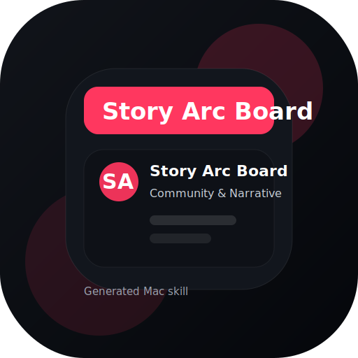
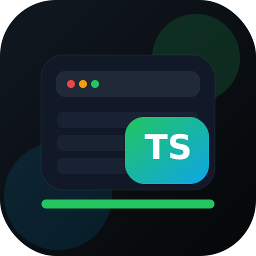

# codex-goated-skills

Community Codex skills and apps for macOS, automation, deployment, design, networking, PDFs, slides, developer workflows, creator-side tooling, and game-side helpers.

Install by name, browse by use case, or pull the full pack when you want a broader toolbox.

[](https://github.com/Arnie016/codex-goated-skills/blob/main/LICENSE)
[](https://github.com/Arnie016/codex-goated-skills/blob/main/scripts/install-all-skills.sh)
[](https://github.com/Arnie016/codex-goated-skills/blob/main/scripts/install-skill.sh)

## Install

Install the CLI once:

```bash
curl -fsSL https://raw.githubusercontent.com/Arnie016/codex-goated-skills/main/scripts/install-cli.sh | sh
```

Then use:

```bash
codex-goated list
codex-goated install network-studio
codex-goated install handoff-courier
codex-goated install repo-ops-lens
codex-goated install screen-snippet-studio
codex-goated install xbox-studio
codex-goated install minecraft-essentials
codex-goated install session-arcade
codex-goated install deckdrop-studio
codex-goated install clipboard-studio
codex-goated install project-hail-mary
codex-goated install find-my-phone-studio
codex-goated install cursor-studio
codex-goated install folder-studio
codex-goated install dark-pdf-studio
codex-goated install --all
codex-goated update vibe-bluetooth
```

Raw script fallback:

```bash
bash <(curl -fsSL https://raw.githubusercontent.com/Arnie016/codex-goated-skills/main/scripts/install-skill.sh) network-studio
```

Then restart Codex.

## Skills vs Apps

- `skills/` are installable Codex skill packages
- `apps/` are standalone project codebases you can open, build, and run

## Start Here

- Fix the blocker first with `workspace-doctor`
- Ship a project with `repo-launch`, `website-drop`, or `content-pack`
- Build a utility with `network-studio`, `find-my-phone-studio`, `clipboard-studio`, or `project-hail-mary`
- Tighten Mac handoffs and AI-assisted workflows with `handoff-courier`, `screen-snippet-studio`, `repo-ops-lens`, or `focus-runway`
- Set up Xbox play, controller, and capture helpers with `xbox-studio`
- Create polished outputs with `dark-pdf-studio` and `deckdrop-studio`

## Recent Skill Factory Additions

These newer skills are now synced into `main`. They also work as lightweight market intelligence for where this repo can keep compounding: AI-assisted developer tooling, browser-native creative handoffs, and compact OSS-style utilities that are easy to understand fast.

- AI infra for developers: `repo-ops-lens`, `screen-snippet-studio`, and `chrome-tab-sweeper`
- Browser-native creative and handoff tools: `launch-deck-lift`, `doc-drop-bridge`, and `handoff-courier`
- Compact Mac utilities with obvious value fast: `battery-trend-scout`, `power-sentry`, `focus-runway`, and `phone-handoff-panel`

| Skill | Category | What it does |
| --- | --- | --- |
| [`battery-trend-scout`](https://github.com/Arnie016/codex-goated-skills/tree/main/skills/battery-trend-scout) | System Monitoring | Calm Mac-style battery panel with charge, power source, energy mode, and trend context. |
| [`chrome-tab-sweeper`](https://github.com/Arnie016/codex-goated-skills/tree/main/skills/chrome-tab-sweeper) | Mac OS | A Mac menu-bar tab control surface for understanding overloaded Chrome windows and closing selected tab piles in one shot. |
| [`doc-drop-bridge`](https://github.com/Arnie016/codex-goated-skills/tree/main/skills/doc-drop-bridge) | Documents | A document packaging bridge that turns notes, markdown, and fragments into share-ready handoff files. |
| [`focus-runway`](https://github.com/Arnie016/codex-goated-skills/tree/main/skills/focus-runway) | Productivity | A quiet focus launcher that trims context switching and starts the next working block cleanly. |
| [`handoff-courier`](https://github.com/Arnie016/codex-goated-skills/tree/main/skills/handoff-courier) | Mac OS | A polished menu-bar courier for moving files, snippets, and exports between apps without window gymnastics. |
| [`launch-deck-lift`](https://github.com/Arnie016/codex-goated-skills/tree/main/skills/launch-deck-lift) | Presentation | A presentation helper that turns a rough idea into a clean launch deck starter. |
| [`phone-handoff-panel`](https://github.com/Arnie016/codex-goated-skills/tree/main/skills/phone-handoff-panel) | Connectivity | A device handoff panel for opening your phone, jump-starting a task, and keeping the Mac in the loop. |
| [`power-sentry`](https://github.com/Arnie016/codex-goated-skills/tree/main/skills/power-sentry) | System Monitoring | A battery-and-power watch that helps you read drain, charging, and energy mode at a glance. |
| [`release-ramp`](https://github.com/Arnie016/codex-goated-skills/tree/main/skills/release-ramp) | Distribution | A release-prep board that turns a shipping checklist into a clean launch lane. |
| [`repo-ops-lens`](https://github.com/Arnie016/codex-goated-skills/tree/main/skills/repo-ops-lens) | Developer Tools | A repo audit panel that turns a GitHub link into a crisp operating brief, risk pass, and next-step suggestion. |
| [`screen-snippet-studio`](https://github.com/Arnie016/codex-goated-skills/tree/main/skills/screen-snippet-studio) | Workflow Automation | A menu-bar capture studio for clipping the current screen into clean prompts, tickets, or handoffs. |
| [`session-arcade`](https://github.com/Arnie016/codex-goated-skills/tree/main/skills/session-arcade) | Games and Consoles | A launch-night helper for game sessions, cloud gaming, and quick console handoffs. |
| [`story-arc-board`](https://github.com/Arnie016/codex-goated-skills/tree/main/skills/story-arc-board) | Community & Narrative | A menu-bar board for capturing repeated hooks from notes, captions, and comments before they disappear into app sprawl. |

## Skills

Browse by use case:
[Launch and Distribution](#launch-and-distribution) ·
[Productivity and Workflow](#productivity-and-workflow) ·
[Audience and Narrative](#audience-and-narrative) ·
[macOS Utility Builders](#macos-utility-builders) ·
[App-Specific Skills](#app-specific-skills) ·
[Games and Consoles](#games-and-consoles)

### Launch and Distribution

| Skill | What it does | Install name |
| --- | --- | --- |
| <br/>[`repo-launch`](https://github.com/Arnie016/codex-goated-skills/tree/main/skills/repo-launch) | Audits and upgrades a rough project into a clean public repo | `repo-launch` |
| <br/>[`website-drop`](https://github.com/Arnie016/codex-goated-skills/tree/main/skills/website-drop) | Audits a web app, picks a host, and gets it live fast | `website-drop` |
| <br/>[`brand-kit`](https://github.com/Arnie016/codex-goated-skills/tree/main/skills/brand-kit) | Builds a reusable logo, color, and launch metadata system | `brand-kit` |
| <br/>[`content-pack`](https://github.com/Arnie016/codex-goated-skills/tree/main/skills/content-pack) | Turns one project into paste-ready launch and README copy | `content-pack` |
| <br/>[`release-ramp`](https://github.com/Arnie016/codex-goated-skills/tree/main/skills/release-ramp) | A release-prep board that turns a shipping checklist into a clean launch lane | `release-ramp` |
| <br/>[`repo-ops-lens`](https://github.com/Arnie016/codex-goated-skills/tree/main/skills/repo-ops-lens) | A repo audit panel that turns a GitHub link into a crisp operating brief, risk pass, and next-step suggestion | `repo-ops-lens` |
| <br/>[`launch-deck-lift`](https://github.com/Arnie016/codex-goated-skills/tree/main/skills/launch-deck-lift) | A presentation helper that turns a rough idea into a clean launch deck starter | `launch-deck-lift` |

### Productivity and Workflow

| Skill | What it does | Install name |
| --- | --- | --- |
| <br/>[`workspace-doctor`](https://github.com/Arnie016/codex-goated-skills/tree/main/skills/workspace-doctor) | Finds the real local setup blocker and next fix fast | `workspace-doctor` |
| <br/>[`clipboard-studio`](https://github.com/Arnie016/codex-goated-skills/tree/main/skills/clipboard-studio) | Shapes a macOS copy-and-paste power tool with history, pinned snippets, and transforms | `clipboard-studio` |
| <br/>[`project-hail-mary`](https://github.com/Arnie016/codex-goated-skills/tree/main/skills/project-hail-mary) | Builds a macOS rescue launcher that can kick off a hype track, open critical work surfaces, start a countdown, and copy a heads-down status update | `project-hail-mary` |
| <br/>[`network-studio`](https://github.com/Arnie016/codex-goated-skills/tree/main/skills/network-studio) | macOS LAN monitor with SwiftBar and a dashboard | `network-studio` |
| <br/>[`dark-pdf-studio`](https://github.com/Arnie016/codex-goated-skills/tree/main/skills/dark-pdf-studio) | Converts PDFs, docs, and images into dark-background reading PDFs with a compact export flow | `dark-pdf-studio` |
| <br/>[`deckdrop-studio`](https://github.com/Arnie016/codex-goated-skills/tree/main/skills/deckdrop-studio) | Builds and refines editable slide deck workflows for mixed-source inputs | `deckdrop-studio` |
| <br/>[`focus-runway`](https://github.com/Arnie016/codex-goated-skills/tree/main/skills/focus-runway) | A quiet focus launcher that trims context switching and starts the next working block cleanly | `focus-runway` |
| <br/>[`screen-snippet-studio`](https://github.com/Arnie016/codex-goated-skills/tree/main/skills/screen-snippet-studio) | A menu-bar capture studio for clipping the current screen into clean prompts, tickets, or handoffs | `screen-snippet-studio` |
| <br/>[`doc-drop-bridge`](https://github.com/Arnie016/codex-goated-skills/tree/main/skills/doc-drop-bridge) | A document packaging bridge that turns notes, markdown, and fragments into share-ready handoff files | `doc-drop-bridge` |
| <br/>[`battery-trend-scout`](https://github.com/Arnie016/codex-goated-skills/tree/main/skills/battery-trend-scout) | Calm Mac-style battery panel with charge, power source, energy mode, and trend context | `battery-trend-scout` |
| <br/>[`power-sentry`](https://github.com/Arnie016/codex-goated-skills/tree/main/skills/power-sentry) | A battery-and-power watch that helps you read drain, charging, and energy mode at a glance | `power-sentry` |

### Audience and Narrative

| Skill | What it does | Install name |
| --- | --- | --- |
| <br/>[`story-arc-board`](https://github.com/Arnie016/codex-goated-skills/tree/main/skills/story-arc-board) | A menu-bar board for capturing repeated hooks from notes, captions, and comments before they disappear into app sprawl | `story-arc-board` |

### macOS Utility Builders

| Skill | What it does | Install name |
| --- | --- | --- |
| <br/>[`find-my-phone-studio`](https://github.com/Arnie016/codex-goated-skills/tree/main/skills/find-my-phone-studio) | Builds a realistic Mac phone-finder utility with locate, ring, call, QR pairing, and provider-aware handoff flows | `find-my-phone-studio` |
| <br/>[`cursor-studio`](https://github.com/Arnie016/codex-goated-skills/tree/main/skills/cursor-studio) | Builds and refines a macOS cursor-pack planner with preset, slot, and export workflows | `cursor-studio` |
| <br/>[`folder-studio`](https://github.com/Arnie016/codex-goated-skills/tree/main/skills/folder-studio) | Builds and refines a macOS folder-skin app with context-aware Finder icon workflows | `folder-studio` |
| <br/>[`handoff-courier`](https://github.com/Arnie016/codex-goated-skills/tree/main/skills/handoff-courier) | A polished menu-bar courier for moving files, snippets, and exports between apps without window gymnastics | `handoff-courier` |
| <br/>[`phone-handoff-panel`](https://github.com/Arnie016/codex-goated-skills/tree/main/skills/phone-handoff-panel) | A device handoff panel for opening your phone, jump-starting a task, and keeping the Mac in the loop | `phone-handoff-panel` |
| <br/>[`chrome-tab-sweeper`](https://github.com/Arnie016/codex-goated-skills/tree/main/skills/chrome-tab-sweeper) | A Mac menu-bar tab control surface for understanding overloaded Chrome windows and closing selected tab piles in one shot | `chrome-tab-sweeper` |

### App-Specific Skills

| Skill | What it does | Install name |
| --- | --- | --- |
| <br/>[`telebar`](https://github.com/Arnie016/codex-goated-skills/tree/main/skills/telebar) | Builds and runs the TeleBar Telegram + AI menu bar app | `telebar` |
| <br/>[`vibe-bluetooth`](https://github.com/Arnie016/codex-goated-skills/tree/main/skills/vibe-bluetooth) | Dev skill for the VibeWidget macOS app and widget | `vibe-bluetooth` |
| <br/>[`framecrawler`](https://github.com/Arnie016/codex-goated-skills/tree/main/skills/framecrawler) | Builds and extends the FrameCrawler prompt-to-Blender SceneSpec workflow, menu bar app, and Blender handoff | `framecrawler` |

### Games and Consoles

| Skill | What it does | Install name |
| --- | --- | --- |
| <br/>[`xbox-studio`](https://github.com/Arnie016/codex-goated-skills/tree/main/skills/xbox-studio) | Builds, runs, and troubleshoots a controller-first macOS Xbox helper for Bluetooth readiness, pairing, cloud gaming, Remote Play, captures, and official account flows | `xbox-studio` |
| <br/>[`minecraft-essentials`](https://github.com/Arnie016/codex-goated-skills/tree/main/skills/minecraft-essentials) | Runs, upgrades, and troubleshoots Minecraft Java servers | `minecraft-essentials` |
| <br/>[`minecraft-skin-studio`](https://github.com/Arnie016/codex-goated-skills/tree/main/skills/minecraft-skin-studio) | Drafts, previews, and registers Minecraft Java skins from prompts or PNGs | `minecraft-skin-studio` |
| <br/>[`session-arcade`](https://github.com/Arnie016/codex-goated-skills/tree/main/skills/session-arcade) | A launch-night helper for game sessions, cloud gaming, and quick console handoffs | `session-arcade` |

## Apps

| App | What it is | Path |
| --- | --- | --- |
| `minecraft-skinbar` | macOS menu bar app for generating, importing, and opening Minecraft skins | [link](https://github.com/Arnie016/codex-goated-skills/tree/main/apps/minecraft-skinbar) |
| `clipboard-studio` | macOS menu bar clipboard context stacker for capture, history, and quick paste back into your editor | [link](https://github.com/Arnie016/codex-goated-skills/tree/main/apps/clipboard-studio) |
| `xbox-studio` | macOS menu bar Xbox control center with Bluetooth and controller readiness first, then cloud gaming, Remote Play launch, connectivity testing, and drag-and-drop capture imports | [link](https://github.com/Arnie016/codex-goated-skills/tree/main/apps/xbox-studio) |
| `phone-spotter` | macOS menu bar phone recovery utility with QR pairing, saved clues, and Apple or Google provider handoff | [link](https://github.com/Arnie016/codex-goated-skills/tree/main/apps/phone-spotter) |
| `flight-scout` | macOS menu bar flight watcher with live fare signals, booking deeplinks, and travel risk scoring | [link](https://github.com/Arnie016/codex-goated-skills/tree/main/apps/flight-scout) |
| `telebar` | macOS Telegram control center for inbox, AI writing, and setup flows | [link](https://github.com/Arnie016/codex-goated-skills/tree/main/apps/telebar) |
| `wifi-watchtower` | macOS menu bar Wi-Fi trust monitor with nearby scan grading | [link](https://github.com/Arnie016/codex-goated-skills/tree/main/apps/wifi-watchtower) |
| `vibe-widget` | macOS SwiftUI app + widget for voice-first vibe control | [link](https://github.com/Arnie016/codex-goated-skills/tree/main/apps/vibe-widget) |
