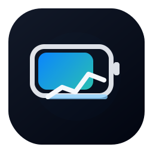
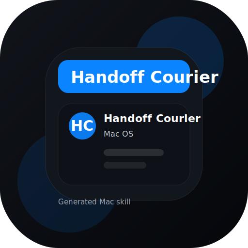
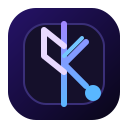

# codex-goated-skills

Community Codex skills and apps for macOS, automation, deployment, design, networking, PDFs, slides, developer workflows, personality-led audience strategy, and game-side helpers.

Install by name, browse by use case, or pull the full pack when you want a broader toolbox.

`SkillBar` is now the primary local manager for the pack: a professional macOS menu bar app that reads this repo, shows what is already installed under `~/.codex/skills`, and enables curated preset bundles from the top bar.

[](https://github.com/Arnie016/codex-goated-skills/blob/main/LICENSE)
[](https://github.com/Arnie016/codex-goated-skills/blob/main/scripts/install-all-skills.sh)
[](https://github.com/Arnie016/codex-goated-skills/blob/main/scripts/install-skill.sh)
[](https://github.com/Arnie016/codex-goated-skills/blob/main/scripts/install-fandom-pack.sh)
[](https://github.com/Arnie016/codex-goated-skills/blob/main/collections/README.md)
[](https://github.com/Arnie016/codex-goated-skills/blob/main/catalog/README.md)

## Install

Install the CLI once:

```bash
curl -fsSL https://raw.githubusercontent.com/Arnie016/codex-goated-skills/main/scripts/install-cli.sh | sh
```

Then use:

```bash
codex-goated list
codex-goated doctor
codex-goated install network-studio
codex-goated install handoff-courier
codex-goated install repo-ops-lens
codex-goated install screen-snippet-studio
codex-goated install wifi-watchtower
codex-goated install minecraft-essentials
codex-goated install session-arcade
codex-goated install deckdrop-studio
codex-goated install clipboard-studio
codex-goated install gain-tracker
codex-goated install on-this-day
codex-goated install on-this-day-bar
codex-goated install trading-archive
codex-goated install skillbar
codex-goated install find-my-phone-studio
codex-goated install flight-scout
codex-goated install cursor-studio
codex-goated install folder-studio
codex-goated install dark-pdf-studio
codex-goated install fan-canon-miner comment-pulse-board iconography-lab
codex-goated search minecraft
codex-goated catalog check
codex-goated audit
codex-goated pack list
codex-goated pack show daily-briefs-and-reference
codex-goated pack show fandom-skill-pack
codex-goated pack show creator-and-fandom-stack
codex-goated pack install daily-briefs-and-reference
codex-goated pack install fandom-skill-pack
codex-goated pack install launch-and-distribution
codex-goated install --all
codex-goated update vibe-bluetooth
```

Raw script fallback:

```bash
bash <(curl -fsSL https://raw.githubusercontent.com/Arnie016/codex-goated-skills/main/scripts/install-skill.sh) network-studio
```

Install a pack:

```bash
bash <(curl -fsSL https://raw.githubusercontent.com/Arnie016/codex-goated-skills/main/scripts/install-pack.sh) creator-and-fandom-stack
```

Then restart Codex.

## Install the Codex plugin

The fastest way to use `macOS Icon Bars` is the one-command installer. You do not need to clone the repo just to use the plugin.

Install the plugin directly:

```bash
bash <(curl -fsSL https://raw.githubusercontent.com/Arnie016/codex-goated-skills/refs/heads/codex/macos-icon-bars-plugin/scripts/install_macos_icon_bars_from_github.sh)
```

Want the repo too? Clone it if you want the source, apps, and every skill folder locally, then run the local installer:

```bash
git clone --branch codex/macos-icon-bars-plugin https://github.com/Arnie016/codex-goated-skills.git
cd codex-goated-skills
./scripts/install_macos_icon_bars.sh
```

That installs the `macOS Icon Bars` plugin into `~/plugins/macos-icon-bars`, registers it in `~/.agents/plugins/marketplace.json`, and makes this repo's bundled skills available through one Codex plugin.

After install, fully quit and reopen Codex, then ask: `What can macOS Icon Bars do?`

Tracking notes:

- The installer sends anonymous aggregate counters for starts and successful installs.
- Approximate unique installs are counted once per Mac by storing a tiny local state file under `~/Library/Application Support/macos-icon-bars/`.
- No username, hostname, or local file paths are sent.
- Disable tracking for a run with:

```bash
MACOS_ICON_BARS_TRACKING=0 bash <(curl -fsSL https://raw.githubusercontent.com/Arnie016/codex-goated-skills/refs/heads/codex/macos-icon-bars-plugin/scripts/install_macos_icon_bars_from_github.sh)
```

- View the current counters locally with:

```bash
./scripts/show_macos_icon_bars_metrics.sh
```

- Public repo tracker page: [`MACOS_ICON_BARS_METRICS.md`](https://github.com/Arnie016/codex-goated-skills/blob/codex/macos-icon-bars-plugin/MACOS_ICON_BARS_METRICS.md)

## Skills vs Apps

- `skills/` are installable Codex skill packages
- `apps/` are standalone project codebases you can open, build, and run

## Collections and Catalog

- Browse all use-case packs in [`collections/README.md`](https://github.com/Arnie016/codex-goated-skills/blob/main/collections/README.md)
- Browse the full audited skill catalog in [`catalog/README.md`](https://github.com/Arnie016/codex-goated-skills/blob/main/catalog/README.md)
- Use the machine-readable index at [`catalog/index.json`](https://github.com/Arnie016/codex-goated-skills/blob/main/catalog/index.json)
- Use `codex-goated search <query>` when you know the problem but not the skill name yet
- Use `codex-goated catalog check` to confirm the generated catalog is current
- Use `codex-goated audit` to validate the skill packages and pack coverage locally

## Popular Packs

| Use case | Pack | Install command |
| --- | --- | --- |
| Launch a project cleanly | `launch-and-distribution` | `codex-goated pack install launch-and-distribution` |
| Build out creator and fandom strategy | `creator-and-fandom-stack` | `codex-goated pack install creator-and-fandom-stack` |
| Install only the personality-led audience suite | `fandom-skill-pack` | `codex-goated pack install fandom-skill-pack` |
| Build a daily ritual stack for facts, pulse, and market-reading archives | `daily-briefs-and-reference` | `codex-goated pack install daily-briefs-and-reference` |
| Build focused Mac utilities | `macos-utility-builders` | `codex-goated pack install macos-utility-builders` |
| Pull the workflow and local tooling stack | `productivity-and-workflow` | `codex-goated pack install productivity-and-workflow` |

## Start Here

- Fix the blocker first with `codex-goated doctor` or `workspace-doctor`
- Ship a project with `repo-launch`, `website-drop`, or `content-pack`
- Build a utility with `network-studio`, `wifi-watchtower`, `find-my-phone-studio`, or `clipboard-studio`
- Tighten handoffs and AI-assisted workflows with `handoff-courier`, `screen-snippet-studio`, `repo-ops-lens`, or `focus-runway`
- Connect GitHub, scan a workspace folder for repos, track daily git gains, and measure a before-versus-now output climb with `gain-tracker`
- Open a same-day historical briefing ritual with `on-this-day` or `on-this-day-bar`
- Build a reusable market-reading archive with `trading-archive`
- Build a personality-led audience strategy stack with the [`Fandom Skill Pack`](https://github.com/Arnie016/codex-goated-skills/blob/main/collections/fandom-skill-pack.md)
- Browse all download packs in [`collections/README.md`](https://github.com/Arnie016/codex-goated-skills/blob/main/collections/README.md)
- Manage the whole pack from the top bar with `skillbar`
- Create polished outputs with `dark-pdf-studio` and `deckdrop-studio`

## Recent Skill Factory Additions

These newer skills are now synced into this repo from the skill-factory lane. They also work as lightweight market intelligence for where this pack can keep winning: AI-assisted developer tooling, browser-native creative handoffs, and compact OSS-flavored utilities that are obvious in under 10 seconds.

- AI infra for developers: `repo-ops-lens`, `screen-snippet-studio`, and `chrome-tab-sweeper`
- Browser-native creative and handoff tools: `launch-deck-lift`, `doc-drop-bridge`, and `handoff-courier`
- Compact Mac utilities with obvious value fast: `battery-trend-scout`, `power-sentry`, `focus-runway`, and `phone-handoff-panel`

| Skill | Category | What it does |
| --- | --- | --- |
| [`battery-trend-scout`](https://github.com/Arnie016/codex-goated-skills/tree/main/skills/battery-trend-scout) | System Monitoring | Calm Mac-style battery panel with charge, power source, energy mode, and trend context. |
| [`chrome-tab-sweeper`](https://github.com/Arnie016/codex-goated-skills/tree/main/skills/chrome-tab-sweeper) | Mac OS | A Mac menu-bar tab control surface for understanding overloaded Chrome windows and closing selected tab piles in one shot. |
| [`doc-drop-bridge`](https://github.com/Arnie016/codex-goated-skills/tree/main/skills/doc-drop-bridge) | Documents | A document packaging bridge that turns notes, markdown, and fragments into share-ready handoff files. |
| [`focus-runway`](https://github.com/Arnie016/codex-goated-skills/tree/main/skills/focus-runway) | Productivity | A quiet focus launcher that trims context switching and starts the next working block cleanly. |
| [`handoff-courier`](https://github.com/Arnie016/codex-goated-skills/tree/main/skills/handoff-courier) | Mac OS | A polished menu-bar courier for moving files, snippets, and exports between apps without window gymnastics. |
| [`launch-deck-lift`](https://github.com/Arnie016/codex-goated-skills/tree/main/skills/launch-deck-lift) | Presentation | A presentation helper that turns a rough idea into a clean launch deck starter. |
| [`phone-handoff-panel`](https://github.com/Arnie016/codex-goated-skills/tree/main/skills/phone-handoff-panel) | Connectivity | A device handoff panel for opening your phone, jump-starting a task, and keeping the Mac in the loop. |
| [`power-sentry`](https://github.com/Arnie016/codex-goated-skills/tree/main/skills/power-sentry) | System Monitoring | A battery-and-power watch that helps you read drain, charging, and energy mode at a glance. |
| [`release-ramp`](https://github.com/Arnie016/codex-goated-skills/tree/main/skills/release-ramp) | Distribution | A release-prep board that turns a shipping checklist into a clean launch lane. |
| [`repo-ops-lens`](https://github.com/Arnie016/codex-goated-skills/tree/main/skills/repo-ops-lens) | Developer Tools | A repo audit panel that turns a GitHub link into a crisp operating brief, risk pass, and next-step suggestion. |
| [`screen-snippet-studio`](https://github.com/Arnie016/codex-goated-skills/tree/main/skills/screen-snippet-studio) | Workflow Automation | A menu-bar capture studio for clipping the current screen into clean prompts, tickets, or handoffs. |
| [`session-arcade`](https://github.com/Arnie016/codex-goated-skills/tree/main/skills/session-arcade) | Games and Consoles | A launch-night helper for game sessions, cloud gaming, and quick console handoffs. |
| [`story-arc-board`](https://github.com/Arnie016/codex-goated-skills/tree/main/skills/story-arc-board) | Community & Narrative | A menu-bar board for capturing repeated hooks from notes, captions, and comments before they disappear into app sprawl. |

## Skills

Browse by use case:
[Launch and Distribution](#launch-and-distribution) ·
[Productivity and Workflow](#productivity-and-workflow) ·
[Audience and Fandom Strategy](#audience-and-fandom-strategy) ·
[macOS Utility Builders](#macos-utility-builders) ·
[App-Specific Skills](#app-specific-skills) ·
[Games and Minecraft](#games-and-minecraft)

### Launch and Distribution

| Skill | What it does | Install name |
| --- | --- | --- |
| <br/>[`repo-launch`](https://github.com/Arnie016/codex-goated-skills/tree/main/skills/repo-launch) | Audits and upgrades a rough project into a clean public repo | `repo-launch` |
| <br/>[`website-drop`](https://github.com/Arnie016/codex-goated-skills/tree/main/skills/website-drop) | Audits a web app, picks a host, and gets it live fast | `website-drop` |
| <br/>[`brand-kit`](https://github.com/Arnie016/codex-goated-skills/tree/main/skills/brand-kit) | Builds a reusable logo, color, and launch metadata system | `brand-kit` |
| <br/>[`content-pack`](https://github.com/Arnie016/codex-goated-skills/tree/main/skills/content-pack) | Turns one project into paste-ready launch and README copy | `content-pack` |
| <br/>[`release-ramp`](https://github.com/Arnie016/codex-goated-skills/tree/main/skills/release-ramp) | A release-prep board that turns a shipping checklist into a clean launch lane | `release-ramp` |
| <br/>[`repo-ops-lens`](https://github.com/Arnie016/codex-goated-skills/tree/main/skills/repo-ops-lens) | A repo audit panel that turns a GitHub link into a crisp operating brief, risk pass, and next-step suggestion | `repo-ops-lens` |
| <br/>[`launch-deck-lift`](https://github.com/Arnie016/codex-goated-skills/tree/main/skills/launch-deck-lift) | A presentation helper that turns a rough idea into a clean launch deck starter | `launch-deck-lift` |

### Productivity and Workflow

| Skill | What it does | Install name |
| --- | --- | --- |
| <br/>[`workspace-doctor`](https://github.com/Arnie016/codex-goated-skills/tree/main/skills/workspace-doctor) | Finds the real blocker, catalog freshness, and next repo-native command fast | `workspace-doctor` |
| <br/>[`gain-tracker`](https://github.com/Arnie016/codex-goated-skills/tree/main/skills/gain-tracker) | Connects GitHub, scans local repo folders, and turns daily git gains into reminder stories and progress toward 90x | `gain-tracker` |
| <br/>[`on-this-day`](https://github.com/Arnie016/codex-goated-skills/tree/main/skills/on-this-day) | Pulls the official Wikimedia day feed into a polished historical briefing or Mac-style day browser | `on-this-day` |
| <br/>[`trading-archive`](https://github.com/Arnie016/codex-goated-skills/tree/main/skills/trading-archive) | Builds a saved archive of trading articles from public feeds, then surfaces a reading queue, source health, and a native menu bar workflow | `trading-archive` |
| <br/>[`skillbar`](https://github.com/Arnie016/codex-goated-skills/tree/main/skills/skillbar) | Builds and refines SkillBar, the macOS top-bar manager for the goated skill catalog, installed state, and preset bundles | `skillbar` |
| <br/>[`clipboard-studio`](https://github.com/Arnie016/codex-goated-skills/tree/main/skills/clipboard-studio) | Shapes Context Assembly on macOS so code, logs, pages, and selections become one structured prompt with resumable state instead of Cmd+C, switch, Cmd+V loops | `clipboard-studio` |
| <br/>[`network-studio`](https://github.com/Arnie016/codex-goated-skills/tree/main/skills/network-studio) | macOS LAN monitor with SwiftBar and a dashboard | `network-studio` |
| <br/>[`dark-pdf-studio`](https://github.com/Arnie016/codex-goated-skills/tree/main/skills/dark-pdf-studio) | Converts PDFs, docs, and images into dark-background reading PDFs with a compact export flow | `dark-pdf-studio` |
| <br/>[`deckdrop-studio`](https://github.com/Arnie016/codex-goated-skills/tree/main/skills/deckdrop-studio) | Builds and refines editable slide deck workflows for mixed-source inputs | `deckdrop-studio` |
| <br/>[`focus-runway`](https://github.com/Arnie016/codex-goated-skills/tree/main/skills/focus-runway) | A quiet focus launcher that trims context switching and starts the next working block cleanly | `focus-runway` |
| <br/>[`screen-snippet-studio`](https://github.com/Arnie016/codex-goated-skills/tree/main/skills/screen-snippet-studio) | A menu-bar capture studio for clipping the current screen into clean prompts, tickets, or handoffs | `screen-snippet-studio` |
| <br/>[`doc-drop-bridge`](https://github.com/Arnie016/codex-goated-skills/tree/main/skills/doc-drop-bridge) | A document packaging bridge that turns notes, markdown, and fragments into share-ready handoff files | `doc-drop-bridge` |
| <br/>[`battery-trend-scout`](https://github.com/Arnie016/codex-goated-skills/tree/main/skills/battery-trend-scout) | Calm Mac-style battery panel with charge, power source, energy mode, and trend context | `battery-trend-scout` |
| <br/>[`power-sentry`](https://github.com/Arnie016/codex-goated-skills/tree/main/skills/power-sentry) | A battery-and-power watch that helps you read drain, charging, and energy mode at a glance | `power-sentry` |

### Audience and Fandom Strategy

Collection:
[`Fandom Skill Pack`](https://github.com/Arnie016/codex-goated-skills/blob/main/collections/fandom-skill-pack.md)

| Skill | What it does | Install name |
| --- | --- | --- |
| <br/>[`fan-canon-miner`](https://github.com/Arnie016/codex-goated-skills/tree/main/skills/fan-canon-miner) | Mines comments, interviews, captions, and fan chatter into a usable canon map | `fan-canon-miner` |
| <br/>[`comment-pulse-board`](https://github.com/Arnie016/codex-goated-skills/tree/main/skills/comment-pulse-board) | Clusters obsession points, recurring questions, sentiment shifts, and backlash signals | `comment-pulse-board` |
| <br/>[`clip-to-canon-finder`](https://github.com/Arnie016/codex-goated-skills/tree/main/skills/clip-to-canon-finder) | Scores clips, transcripts, and reactions to find moments that deserve repeat canon | `clip-to-canon-finder` |
| <br/>[`iconography-lab`](https://github.com/Arnie016/codex-goated-skills/tree/main/skills/iconography-lab) | Defines the recognizable visual and verbal codes of a personality-led brand | `iconography-lab` |
| <br/>[`ritual-engine`](https://github.com/Arnie016/codex-goated-skills/tree/main/skills/ritual-engine) | Designs repeatable fan rituals, loops, naming systems, and recurring formats | `ritual-engine` |
| <br/>[`parasocial-studio`](https://github.com/Arnie016/codex-goated-skills/tree/main/skills/parasocial-studio) | Shapes safe closeness mechanics and recurring relationship touchpoints | `parasocial-studio` |
| <br/>[`lore-drop-planner`](https://github.com/Arnie016/codex-goated-skills/tree/main/skills/lore-drop-planner) | Plans episodic reveals, callbacks, teasers, and payoff arcs | `lore-drop-planner` |
| <br/>[`inner-circle-director`](https://github.com/Arnie016/codex-goated-skills/tree/main/skills/inner-circle-director) | Structures tiered access, VIP mechanics, and premium community experiences | `inner-circle-director` |
| <br/>[`myth-merch-studio`](https://github.com/Arnie016/codex-goated-skills/tree/main/skills/myth-merch-studio) | Turns symbols, phrases, and fandom lore into merch and collectible concepts | `myth-merch-studio` |
| <br/>[`reputation-heatmap`](https://github.com/Arnie016/codex-goated-skills/tree/main/skills/reputation-heatmap) | Separates healthy mystique from rumor, overreach, parasocial risk, or brand harm | `reputation-heatmap` |
| <br/>[`story-arc-board`](https://github.com/Arnie016/codex-goated-skills/tree/main/skills/story-arc-board) | A menu-bar board for capturing repeated hooks from notes, captions, and comments before they disappear into app sprawl | `story-arc-board` |

### macOS Utility Builders

| Skill | What it does | Install name |
| --- | --- | --- |
| <br/>[`find-my-phone-studio`](https://github.com/Arnie016/codex-goated-skills/tree/main/skills/find-my-phone-studio) | Builds a realistic Mac phone-finder utility with locate, ring, call, QR pairing, and provider-aware handoff flows | `find-my-phone-studio` |
| <br/>[`cursor-studio`](https://github.com/Arnie016/codex-goated-skills/tree/main/skills/cursor-studio) | Builds and refines a macOS cursor-pack planner with preset, slot, and export workflows | `cursor-studio` |
| <br/>[`folder-studio`](https://github.com/Arnie016/codex-goated-skills/tree/main/skills/folder-studio) | Builds and refines a macOS folder-skin app with context-aware Finder icon workflows | `folder-studio` |
| <br/>[`handoff-courier`](https://github.com/Arnie016/codex-goated-skills/tree/main/skills/handoff-courier) | A polished menu-bar courier for moving files, snippets, and exports between apps without window gymnastics | `handoff-courier` |
| <br/>[`phone-handoff-panel`](https://github.com/Arnie016/codex-goated-skills/tree/main/skills/phone-handoff-panel) | A device handoff panel for opening your phone, jump-starting a task, and keeping the Mac in the loop | `phone-handoff-panel` |
| <br/>[`chrome-tab-sweeper`](https://github.com/Arnie016/codex-goated-skills/tree/main/skills/chrome-tab-sweeper) | A Mac menu-bar tab control surface for understanding overloaded Chrome windows and closing selected tab piles in one shot | `chrome-tab-sweeper` |

### App-Specific Skills

| Skill | What it does | Install name |
| --- | --- | --- |
| <br/>[`telebar`](https://github.com/Arnie016/codex-goated-skills/tree/main/skills/telebar) | Builds and runs the TeleBar Telegram + AI menu bar app | `telebar` |
| <br/>[`flight-scout`](https://github.com/Arnie016/codex-goated-skills/tree/main/skills/flight-scout) | Builds and runs the Flight Scout menu bar app | `flight-scout` |
| <br/>[`on-this-day-bar`](https://github.com/Arnie016/codex-goated-skills/tree/main/skills/on-this-day-bar) | Builds and runs the On This Day Bar macOS menu bar app | `on-this-day-bar` |
| <br/>[`vibe-bluetooth`](https://github.com/Arnie016/codex-goated-skills/tree/main/skills/vibe-bluetooth) | Dev skill for the VibeWidget macOS app and widget | `vibe-bluetooth` |
| <br/>[`wifi-watchtower`](https://github.com/Arnie016/codex-goated-skills/tree/main/skills/wifi-watchtower) | Builds and runs the WiFi Watchtower macOS menu bar app | `wifi-watchtower` |

### Games and Minecraft

| Skill | What it does | Install name |
| --- | --- | --- |
| <br/>[`minecraft-essentials`](https://github.com/Arnie016/codex-goated-skills/tree/main/skills/minecraft-essentials) | Runs, upgrades, and troubleshoots Minecraft Java servers | `minecraft-essentials` |
| <br/>[`minecraft-skin-studio`](https://github.com/Arnie016/codex-goated-skills/tree/main/skills/minecraft-skin-studio) | Drafts, previews, and registers Minecraft Java skins from prompts or PNGs | `minecraft-skin-studio` |
| <br/>[`session-arcade`](https://github.com/Arnie016/codex-goated-skills/tree/main/skills/session-arcade) | A launch-night helper for game sessions, cloud gaming, and quick console handoffs | `session-arcade` |

## Apps

| App | What it is | Path |
| --- | --- | --- |
| `minecraft-skinbar` | macOS menu bar app for generating, importing, and opening Minecraft skins | [link](https://github.com/Arnie016/codex-goated-skills/tree/main/apps/minecraft-skinbar) |
| `clipboard-studio` | Context Assembly, a macOS menu bar app that turns code, logs, pages, and saved app state into one structured prompt, Apple Note, or Markdown export instead of manual copy-paste switching | [link](https://github.com/Arnie016/codex-goated-skills/tree/main/apps/clipboard-studio) |
| `phone-spotter` | macOS menu bar phone recovery utility with QR pairing, saved clues, and Apple or Google provider handoff | [link](https://github.com/Arnie016/codex-goated-skills/tree/main/apps/phone-spotter) |
| `flight-scout` | macOS menu bar flight watcher with live fare signals, booking deeplinks, and travel risk scoring | [link](https://github.com/Arnie016/codex-goated-skills/tree/main/apps/flight-scout) |
| `on-this-day` | macOS-style daily history web app with official Wikimedia same-day events, births, deaths, and holidays | [link](https://github.com/Arnie016/codex-goated-skills/tree/main/apps/on-this-day) |
| `on-this-day-bar` | native macOS menu bar app for same-day history with curated events, cached fallback, and one-click article handoff | [link](https://github.com/Arnie016/codex-goated-skills/tree/main/apps/on-this-day-bar) |
| `trading-archive-bar` | native macOS menu bar archive for trading and macro articles with feed ingest, search, favorites, and cached fallback | [link](https://github.com/Arnie016/codex-goated-skills/tree/main/apps/trading-archive-bar) |
| `skillbar` | macOS menu bar manager for browsing the goated skill catalog, installed local skills, and preset bundles | [link](https://github.com/Arnie016/codex-goated-skills/tree/main/apps/skillbar) |
| `telebar` | macOS Telegram control center for inbox, AI writing, and setup flows | [link](https://github.com/Arnie016/codex-goated-skills/tree/main/apps/telebar) |
| `wifi-watchtower` | macOS menu bar Wi-Fi trust monitor with nearby scan grading | [link](https://github.com/Arnie016/codex-goated-skills/tree/main/apps/wifi-watchtower) |
| `vibe-widget` | macOS SwiftUI app + widget for voice-first vibe control | [link](https://github.com/Arnie016/codex-goated-skills/tree/main/apps/vibe-widget) |
